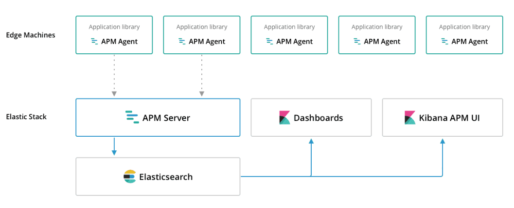

# Elastic APM 사용하기

* 서버 장애 원인 분석 및 성능 분석을 위해 APM 사용하기


## 시스템 구성


### APM Python Agent
* 파이썬으로 구현된 APM client agent
* 에러나 성능 매트릭스를 수집함
* 수집한 에러나 성능 관련 정보를 APM 서버로 전송

### APM Server
* Agent 가 전송한 데이터를 수집하고 문서를 생성하고 Elasticsearch 에 저장함
### Elasticsearch
### Kibana


## 설치

### ElasticSearch + APMServer + Kibana
```docker
version: '3.6'

services:

  elasticsearch:
    container_name: 'elk-elasticsearch'
    build:
      context: elasticsearch/
    volumes:
      - ./elasticsearch/config/elasticsearch.yml:/usr/share/elasticsearch/config/elasticsearch.yml:ro
    ports:
      - "9200:9200"
      - "9300:9300"
    environment:
      ES_JAVA_OPTS: "-Xmx256m -Xms256m"
    networks:
      - elk

  kibana:
    container_name: 'elk-kibana'
    build:
      context: kibana/
    volumes:
      - ./kibana/config/:/usr/share/kibana/config:ro
    ports:
      - "5601:5601"
    networks:
      - elk
    depends_on:
      - elasticsearch

  apmserver:
    container_name: 'elk-apmserver'
    build:
      context: apmserver/
    networks:
      - elk
    depends_on:
      - elasticsearch
    ports:
      - "8200:8200"

networks:

  elk:
    driver: bridge

```

### Django 설정

#### APM Python Agent 설치

```sh
$ pip install elastic-apm
```

#### 설정

1. Django Project settings.py에 다음 내용 추가

```python
INSTALLED_APPS = (
    # ...
    'elasticapm.contrib.django',
)
```

2. Elastic APM 서비스 명과 필요한 경우 비밀 토큰 설정 추가
```python
ELASTIC_APM = {
    'SERVICE_NAME': '<SERVICE-NAME>',
    'SECRET_TOKEN': '<SECRET-TOKEN>',
}
```
아래 코드와 같이 시스템 환경 변수에 추가 가능
```python
ELASTIC_APM_SERVICE_NAME=<SERVICE-NAME>
ELASTIC_APM_SECRET_TOKEN=<SECRET-TOKEN>
```

* HTTP 500에러를 포함해 기본 에러 로그가 APM 서버로 전송 됨
* agent 는 DEBUG = False 로 설정 되어 있는 경우만 에러를 잡아내고 APM Server로 전송, 장고 디버그 모드에서 에러를 잡아내고 APM Server로 전송이 필요한 경우 아래와 같이 설정에 DEBUG = True를 추가함
```python
ELASTIC_APM = {
    # ...
    'DEBUG': True,
}
```

### Performance Metrics(성능 매트릭스)
성능 매트릭스를 Elastic APM에 전송이 필요한 경우 MIDDLEWARE 설정에 다음을 추가 함
```python
MIDDLEWARE = {
    'elasticapm.contrib.django.middleware.TracingMiddleware',
    # ...
}
```
반드시 MIDDLEWARE 설정의 최상단에 추가 해야 함.(그렇지 않으면 시스템 실행 시에 경고 메시지 표시)

### Logging
장고 로그 시스템에 APM agent를 추가해서 사용자 로그 수집 가능하며 아래와 같이 설정함
```python

LOGGING = {
    'version': 1,
    'disable_existing_loggers': True,
    'formatters': {
        'verbose': {
            'format': '%(levelname)s %(asctime)s %(module)s %(process)d %(thread)d %(message)s'
        },
    },
    'handlers': {
        'elasticapm': {
            'level': 'WARNING',
            'class': 'elasticapm.contrib.django.handlers.LoggingHandler',
        },
        'console': {
            'level': 'DEBUG',
            'class': 'logging.StreamHandler',
            'formatter': 'verbose'
        }
    },
    'loggers': {
        'django.db.backends': {
            'level': 'ERROR',
            'handlers': ['console'],
            'propagate': False,
        },
        'elk-apm': {
            'level': 'WARNING',
            'handlers': ['elasticapm'],
            'propagate': False,
        },
        'elasticapm.errors': {
            'level': 'ERROR',
            'handlers': ['console'],
            'propagate': False,
        },
    },
}
```

#### Logger 사용 예제

```python
import logging
logger = logging.getLogger('mysite')

try:
    instance = MyModel.objects.get(pk=42)
except MyModel.DoesNotExist:
    logger.error(
        'Could not find instance, doing something else',
        exc_info=True
    )
```
**exc_info=True**를 추가 하면 에러 발생시 예외 정보를 추가로 APM Server에 전송 가능 **exc_info=True**를 추가 하지않으면 message만 전송 됨

## 문제 해결
Elastic APM 설정 후 장고 커멘드를 사용해 정상 설치 여부 확인 가능
```shell
$ python manage.py elasticapm check
```

현재 설정으로 테스트 로그를 APM Server로 전송할 때는 아래 커멘드 사용
```shell
$ python manage.py elasticapm test
```

## 지원 버전
장고는 1.8 ~ 1.11 까지 지원하고 Python은 2.7, 3.3, 3.4, 3.5, 3.6 버전 지원

## Reference
[1]. [Getting Started with APM(Overview)](https://www.elastic.co/guide/en/apm/get-started/current/overview.html)